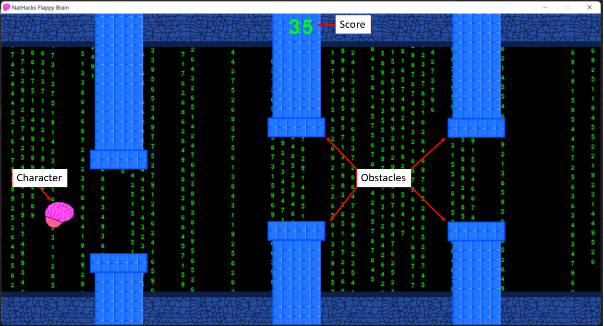
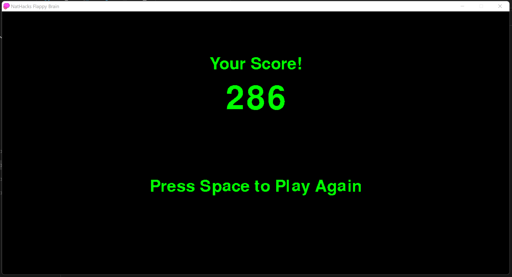

# Flappy Brain

A flappybird like game where the brain moves along the screen and has to dodge pipes. To play the game press the space bar to move the character up and leave it to fall. The objective of the game is to stay alive as long as possible.

The game is built in python using the pygame library

## Gameplay

### Play
Your character is the brain.

Press Space to make the character jump up

Avoid the blue obstacles and don't let the character hit the ground

### Restart

When you hit an obstacle the game will close and a menu showing your score will be displayed. You can press space to play again or close the window to stop the game

At any time you can press the x or esc to close the game

## Execution

To run the program on a windows machine open the file "Flappy Brain.exe"

To run the program in python clone the repository, then open and run the file "FlappyBrain.py"

Either 